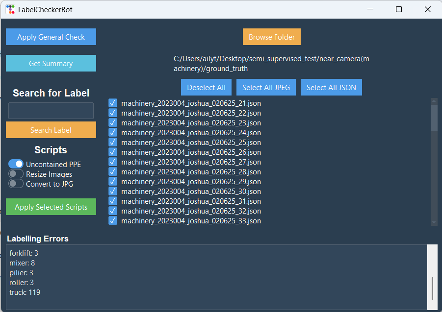

# Data Processing GUI for Ailytics
An easy-to-use GUI application for streamlining data pipeline processes in computer vision projects. This tool consolidates multiple Python scripts into a single application, enabling both data pre-processing and post-processing tasks through a simple interface.

The application is built in Python using an Object-Oriented Programming (OOP) approach to ensure modularity, scalability, and ease of maintenance, and afterwards packaged into a standalone `.exe` using PyInstaller for convenient distribution.

To run the application, simply run the main code "labelcheckerbot.py" or run the .exe file in the "dist" folder found here https://drive.google.com/drive/folders/1ea3fBITeq5qFsHKCfPHlWhO82J29yoLs?usp=sharing

## Features
### Data Insights
- Get Summary – View the count of class instances in your dataset.
- Search Labels – Retrieve all files containing a specific class.
### Data Preprocessing
- Image File Conversion  – Convert images to `.jpg` format.
- Reduce File Size – Remove embedded imageData from JSON files.
- Resize Image – Adjust image dimensions for consistency.
### Data Quality Checks
- General Dataset Checks – Identify and flag out the following errors:
  - Incorrect file formatting (wrong extensions, aspect ratio errors)
  - Duplicate labels
  - Unknown classes
  - Invalid bbox 
  - Uncontained worker PPE (PPE not fully bounded within worker bbox)

Upon conducting a general dataset check on a given folder containing image and JSON files, the GUI will flag out files with errors found, prompting the user to make the respective changes to them, most of which can be performed within the GUI itself.  

## Tech Stack & Design
- **Language**: Python
- **GUI Frameworks**: tkinter, ttkbootstrap
- **Design Pattern**: Object-Oriented Programming (OOP) for modular GUI components and reusability
- **Packaging**: PyInstaller for `.exe` distribution

## Example Screenshot

